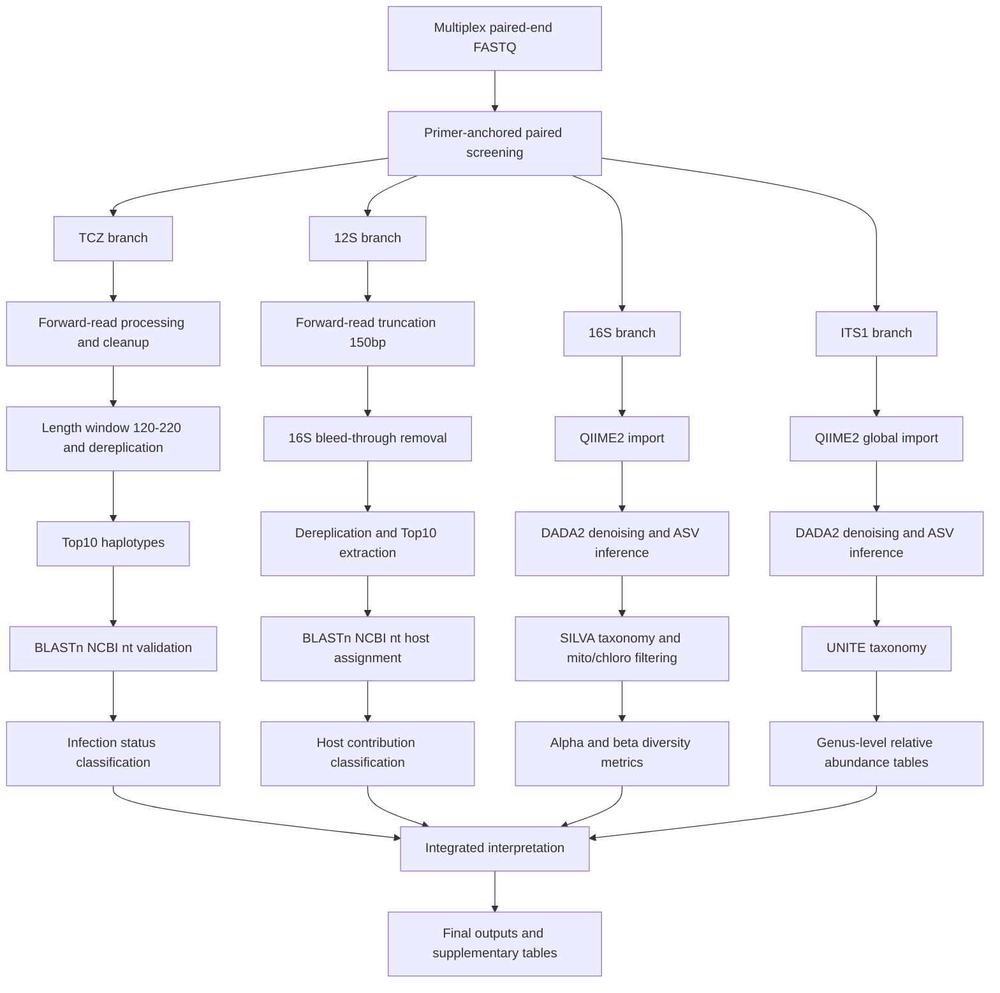

# Integrative metabarcoding reveals <i>Trypanosoma cruzi</i> infection, blood-feeding patterns, and gut microbiota in the peridomestic vector <i>Triatoma costalimai</i>

## Authors and Affiliations

Paula Beatriz de Medeiros Santiago<sup>1</sup>; Gabriela Dantas Ribeiro Stival Fontoura<sup>1,2</sup>; Rodrigo Gurgel-Goncalves<sup>3</sup>; Marcos Takashi Obara<sup>4</sup>; Vinicius Lima de Miranda; Waldeyr Mendes Cordeiro da Silva<sup>5</sup>; Izabela Marques Dourado Bastos<sup>1</sup>; Sebastien Charneau<sup>6</sup>; Coralie Martin<sup>7</sup>; Jaime Martins Santana<sup>1,2</sup>; Carla Nunes de Araujo<sup>1,2,4,*</sup>

1. Universidade de Brasilia, Instituto de Ciencias Biologicas, Laboratorio de Interacao Patogeno-Hospedeiro, Brasilia, DF, Brazil  
2. Universidade de Brasilia, Programa de Pos-Graduacao em Ciencias Medicas, Brasilia, DF, Brazil  
3. Universidade de Brasilia, Faculdade de Medicina, Laboratorio de Parasitologia Medica e Biologia de Vetores, Brasilia, DF, Brazil  
4. Universidade de Brasilia, Faculdade de Ciencias e Tecnologias em Saude, Ceilandia, DF, Brazil  
5. Instituto Federal de Goias (IFG), Campus Formosa, Formosa, GO, Brazil  
6. Universidade de Brasilia, Instituto de Ciencias Biologicas, Laboratorio de Bioquimica e Quimica de Proteinas, Brasilia, DF, Brazil  
7. Unite Molecules de Communication et Adaptation des Microorganismes (MCAM UMR 7245), Museum national d'Histoire naturelle, CNRS, Paris, France  

\* Corresponding author: `cnunes@unb.br`

## Abstract

<i>Trypanosoma cruzi</i> causes Chagas disease and circulates through complex transmission cycles involving triatomine vectors and multiple vertebrate hosts across sylvatic, peridomestic, and domestic environments. <i>Triatoma costalimai</i> is a native Cerrado vector associated with rocky habitats and increasingly reported in peridomestic settings. This study applied an integrative metabarcoding strategy to investigate <i>T. cruzi</i> infection in field-collected <i>T. costalimai</i> gut samples, while simultaneously characterizing vertebrate blood meal sources and gut microbiota. Six of thirteen specimens were infected with <i>T. cruzi</i>. Blood meal analysis identified mainly domestic animal hosts, with human blood detected in two specimens. Bacterial profiles were dominated by <i>Actinobacteriota</i>. These results support the epidemiological relevance of peridomestic <i>T. costalimai</i> as a potential bridge vector between sylvatic and domestic cycles and highlight the value of integrated molecular surveillance.

## Keywords

`Triatoma costalimai`; `Trypanosoma cruzi`; `Blood meal sources`; `Gut microbiota`; `Metabarcoding`

## Methodology

### Study Design and Multi-Amplicon Strategy

- Input material: multiplex Illumina MiSeq paired-end reads (`2x300`) from gut DNA of 13 field-collected `T. costalimai` specimens.
- Four markers were processed from the same multiplex libraries:
  - `TCZ` satDNA (parasite detection)
  - vertebrate `12S` (blood meal source)
  - bacterial `16S` V3-V4 (gut bacteriome)
  - fungal `ITS1` (gut mycobiome)
- General rule for marker extraction: retain only paired reads with correct forward/reverse primer detection in anchored orientation.

### Marker-Specific Processing

#### 1) TCZ satDNA branch

- Strict paired-end primer filtering (`TCZ1/TCZ2`) with `cutadapt`.
- Forward-read strategy after primer screening to avoid merge-driven read loss/artifacts.
- Technical sequence and residual primer removal.
- Length-window filtering (`120-220 bp`) and FASTA conversion.
- Exact dereplication (`vsearch`) and Top10 haplotype extraction per sample.
- BLASTn validation against NCBI nt.
- Infection status classification:
  - `T. cruzi-positive`: `>= 3` validated haplotypes
  - `T. cruzi-low signal`: `1-2` validated haplotypes
  - `T. cruzi-negative`: `0` validated haplotypes

#### 2) Vertebrate 12S branch

- Paired primer screening (`12S_L1085/12S_H1259`) with `cutadapt`.
- Forward reads truncated to `150 bp`.
- Removal of 16S bleed-through signature sequence.
- FASTA conversion, exact dereplication (`vsearch`), and Top10/Top1 extraction.
- BLASTn host assignment with minimum support and identity/coverage thresholds.
- Relative host contribution classes:
  - `Principal`: `>= 50%`
  - `Detected`: `>= 5% and < 50%`
  - `Weak evidence`: `< 5%`

#### 3) Bacterial 16S branch

- Primer-anchored extraction (`16S_F/16S_R`) from multiplex reads.
- QIIME2 import and DADA2 denoising (`trunc-len-f=260`, `trunc-len-r=220`).
- ASV taxonomic assignment with `q2-feature-classifier`/VSEARCH consensus against `SILVA 138`.
- Removal of mitochondrial/chloroplast assignments.
- Per-sample and global feature-table generation, taxonomy barplots, phylogenetic tree, and core diversity metrics.
- Rarefaction depth for diversity analyses: `70000 reads/sample`.

#### 4) Fungal ITS1 branch

- Primer-anchored extraction (`ITS1_F/ITS1_R`).
- Global QIIME2 import and DADA2 denoising (`trunc-len-f=150`, `trunc-len-r=150`).
- Taxonomic classification against `UNITE v10 (99%)` with VSEARCH consensus.
- Taxa barplots and genus-level relative abundance tables.

### Reference Databases and Validation Rules

| Analysis branch | Database | Version / Source | Main decision criteria |
|---|---|---|---|
| Bacterial 16S | SILVA | 138 | Consensus taxonomy, identity threshold `>= 97%` |
| Fungal ITS1 | UNITE | v10, 99% clustered | Consensus taxonomy, identity threshold `>= 97%` |
| TCZ haplotypes | NCBI nt (BLASTn) | NCBI | Coverage `>= 95%`, identity `>= 98%`, E-value `<= 1e-20` |
| 12S host haplotypes | NCBI nt (BLASTn) | NCBI | Coverage `>= 95%`, identity `>= 98%`, E-value `<= 1e-20`, min abundance cutoff |

## Environment Setup

### 1) Base runtime (QIIME2 in Docker)

```bash
docker pull quay.io/qiime2/amplicon:2024.10
docker run --name qiime2_tcz -it -v qiime2_data:/data quay.io/qiime2/amplicon:2024.10
```

### 2) Python virtual environment for auxiliary scripts

Create and activate `.venv` from repository root:

```bash
python3 -m venv .venv
source .venv/bin/activate
python -m pip install --upgrade pip
pip install -r requirements.txt
```

Deactivate when done:

```bash
deactivate
```

Re-activate in future sessions:

```bash
cd /path/to/integrative_metabarcoding_triatoma_costalimai
source .venv/bin/activate
```

## Pipeline Diagram (Intermediate Detail)



## Sequential Execution Commands

The commands below describe the end-to-end execution order used in the study. Adjust sample identifiers, paths, and thread counts according to your environment.

### 0) Prepare directories and activate environments

```bash
cd /data
mkdir -p raw_data tcz_pipeline 12S_pipeline 16S_pipeline ITS_pipeline refdb
```

Optional local helper environment:

```bash
cd /path/to/integrative_metabarcoding_triatoma_costalimai
source .venv/bin/activate
```

### 1) TCZ processing

```bash
bash /data/tcz_pipeline/run_TCZ_primerfree_window_loop_v2.sh
```

Main expected outputs:
- `/data/tcz_pipeline/TCZ_final_summary.tsv`
- `/data/tcz_pipeline/TCZ_top10_all_samples.fasta`

### 2) 12S processing

```bash
bash /data/12S_pipeline/run_12S_loop.sh
```

Main expected outputs:
- `/data/12S_pipeline/12S_final_table.tsv`
- `/data/12S_pipeline/12S_top10_all_samples_labeled.oneline.fasta`

### 3) 16S processing (QIIME2)

Representative command blocks:

```bash
# import, denoise, classify, filter non-bacterial features, merge outputs
qiime tools import ...
qiime dada2 denoise-paired ...
qiime feature-classifier classify-consensus-vsearch ...
qiime taxa filter-table ...
qiime diversity core-metrics-phylogenetic --p-sampling-depth 70000 ...
```

Main expected outputs:
- `/data/16S_pipeline/16S_table_global_nomito.qza`
- `/data/16S_pipeline/16S_taxonomy_global_nomito.qza`
- `/data/16S_pipeline/16S_core_metrics_70000/`

### 4) ITS1 processing (QIIME2)

Representative command blocks:

```bash
# import, denoise, classify against UNITE, collapse to genus, export tables
qiime tools import ...
qiime dada2 denoise-paired ...
qiime feature-classifier classify-consensus-vsearch ...
qiime taxa collapse ...
qiime feature-table relative-frequency ...
```

Main expected outputs:
- `/data/ITS_pipeline/ITS1_table_global_t1.qza`
- `/data/ITS_pipeline/ITS1_taxonomy_global_t1.qza`
- `/data/ITS_pipeline/ITS1_genus_rel_table_QIIME_clean.tsv`

### 5) BLASTn validation for TCZ and 12S top haplotypes

```bash
# run BLASTn for consolidated Top10 FASTA files
# then apply coverage/identity/e-value thresholds
blastn -query <top_haplotypes.fasta> -db nt -outfmt 6 -max_target_seqs 10 -evalue 1e-20 -out <results.tsv>
```

### 6) Integrated review checklist

- Confirm sample-wise consistency across `TCZ`, `12S`, `16S`, and `ITS1` outputs.
- Confirm threshold rules were applied identically across all specimens.
- Confirm summary tables and visual outputs are present for every branch.

## Reproducibility Notes

- All branches were run with standardized scripts and harmonized filtering criteria.
- Parameter choices from each marker-specific workflow were propagated to final interpretation.
- Intermediate files, logs, and final tables are required to maintain full auditability.

